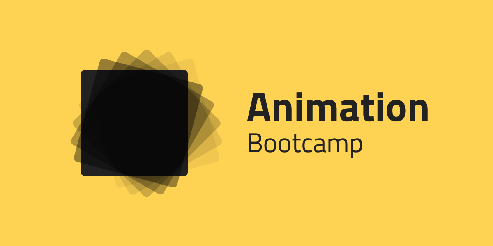

# CSS Animation Bootcamp
[CSS Tricks: Transitions](https://css-tricks.com/almanac/properties/t/transition/)
## 1. Transitions

### Hover Button
Gör en knapp som på ```:hover``` gör en mjuk övergång på följande egenskaper: 

* transform: scale
* background-color
* box-shadow


### Animated Placeholders
Animera placeholders så att de flyttar på sig med `:focus`.

[Demo](examples/02_inputplaceholder/form-inputs.mov)
<!-- <video src="examples/02_inputplaceholder/form-inputs.mov"> -->

### Message Dialog

Skapa en dialog som du visar genom att trycka på en knapp som länkar till dialogen. Använd `:target` för att välja elementet med IDt som du länkar till. 

Animera saker som
* opacity
* scale

Lägg också till ett lager som gör resten av webbsidan mörk.

### Pride cards

Gör en kortlek med 9 kort som vid hover av body sprider ut sig i en solfjäder.


## 2. Keyframes
[CSS Tricks: Key Frames](https://css-tricks.com/snippets/css/keyframe-animation-syntax/)

### Four corners

* Gör en fyrkant på 500 x 500px centrerad på skärmen. 
* Inuti denna ska du nu animera en kvadrat som går från hörn till hörn. 
* För varje hörn ska den stanna upp och byta färg innan den fortsätter.


### Spinner

Gör en loader eller spinner som kan visas medan en sida eller del av sida laddas.


### Stopwatch

Gör ett tidtagarur med en snurrande sekund- samt en minutvisare. 


## 3. 3D animations

### Starwars crawler
Gör en *text crawler* som likt [introt till Starwars](https://www.youtube.com/watch?v=h5psCjg5-cI) scrollar [text](https://starwars.fandom.com/wiki/Opening_crawl) bort mot horisonten.

Extra stjärnor i rymdkanten om det liknar introsekvensen med rymdbakgrund, rätt fonter, [logotyp](https://upload.wikimedia.org/wikipedia/commons/9/9b/Star_Wars_Yellow_Logo.svg), färger etc.


### Flip a card

Skapa ett kort som lyfts upp, snurrar runt 360 grader och sen läggs ner igen.

**Levelup:** Gör kortet tvåsidigt med olika fäger / sida.


